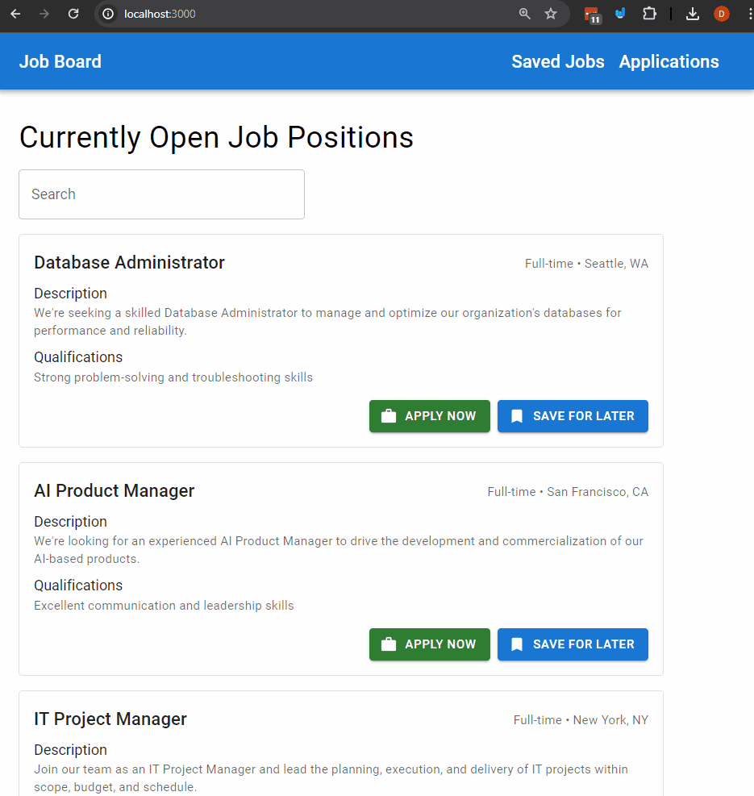

# Assignment 4b - Routing and Pages with our Job Board.

This assignment will test your knowledge using routing in a Next.js application using static and dynamic routes. It will also continue to test your knowledge of using REST APIs when a page is loaded.

You will be assessed on your knowledge of the following:
- using routing in a Next.js application
- using route parameters from the URL in a Next.js application
- making requests to a REST API in a Next.js application.
- managing the state of the result of REST API calls

**IMPORTANT NOTE**: this project will be using a similar backend to assignment 4a. It was implemented as part of the `Next.js pages/api` folder which are endpoints that run from the same domain as the frontend. Please refer to the [backend documentation for the endpoints](./prisma-backend-tools/README.md).

## Steps

Note: If you're getting an error when hitting the API endpoints please run `npm run generate-db` to generate the database and then run `npm run dev` to start the server.

1. Create the NavBar with the links to the correct pages.
    - Change the `components/NavBar.js` to have the following links:
      - Home which will navigate to the home page.
      - Saved jobs which will navigate to the saved jobs page you will create with the path `/saved-jobs`.
      - Please do this with the `Link` component provided by Next.js.

2. Create a page for the path `/saved-jobs` path that will list the items, give you the ability to delete items, and navigate to apply to saved jobs.
    - create a page in the pages router that will have the following page path `/saved-jobs`.
    - Use the `useEffect` hook to load the saved jobs when the page is loaded, this should use the `getSavedJobsDetails` function in the `utils/api/jobs.js` file to get the saved jobs.
    - When the page is loading show a loading page, or spinner of sorts.
    - Create the page using the components in the `components/savedJobs` folder to display the saved jobs. This should look like the "Expected Output/Functionality" section below.

3. Add the functionality on the `SavedJobItem` components' buttons.
    - import the `useRouter` hook from `next/router` and initialize it in the component.
    - If the user clicks on "apply" for this job then the user should be redirected to the apply for this job page. The path for this page should be `/apply/[id]` where the id is the job id. Note: you'll be creating this page in the next few steps.
      - Please do this with the `push` method from the router instance (where the router instance is from the `useRouter` hook)
    - If the user clicks on "delete" for this job then the user should use the function `deleteSavedJob` and "reload" the page using the router initialized with the `useRouter` hook (see https://nextjs.org/docs/pages/api-reference/functions/use-router#routerreload). The job clicked on should be removed from the saved jobs list, please look at the "Expected Output/Functionality" section below for how it should look.

4. Create the "Apply for job Page"
    - Make a page using the pages router that will have the following path `/apply/[id]` where the id is the job id.
    - Use the `useRouter` hook to get the job id
    - use the `useEffect` hook to load the specific job when the page is loaded. Note: use the `router.isReady` as a dependency and in your effect (see https://nextjs.org/docs/pages/api-reference/functions/use-router#router-object). You can use the `getJob` function in the `utils/api/jobs.js` file to get the job details.
    - use the components in the `components/apply` folder to display the job details and the form to apply for the job.
      - Note: the form should be on the left and the job details should be on the right if it's full screen, and if it's a half screen (like the "Expected Output/Functionality" section below) the form should be on top and the job details on the bottom. You `Grid` component from MUI to layout this page.

5. Add the functionality to be able to apply for the job successfully in the `components/apply/ApplyJobForm` component.
    - When the form is submitted it should make a post request to the `saved-jobs` endpoint with the correct jobId, you can use the function `postApplication` in the `utils/api/jobs.js` file to make the post request.
      - Ensure that all of the inputs are using state and are controlled properly.
      - Refer to the documentation of the endpoints (specifically under the header "POST an application") in the [backend documentation](./prisma-backend-tools/README.md#post-an-application) to see what the request body should look like.
    - If the job is saved the form should change to the `components/apply/SuccessfulApplicationMessage` component.
      - Use the `submitCallback` prop to implement this behaviour (should be passed a function from the apply page).
    - Please take a look at the "Expected Output/Functionality" section below for how it should look.

6. Add the functionality to navigate to the specific Job Application page from the `index.js` page, in each `JobItem` component.
  - Please do this with the `push` method from the router instance (where the router instance is from the `useRouter` hook)
  -  Please take a look at the "Expected Output/Functionality" section below for how it should look.

## Expected Output/Functionality
The expected output should look like the following:

## Bonus (only attempt this if you are done with the above steps)
- Create a page with the path `/applications` that will list the jobs you've applied for.
  - you should be able to delete applications to a specific job.
  - The NavBar should have a link to this page as well.
  - To get full marks this should look cohesive with the rest of the application, no marks for stuff that will not look good.
## Challenges (only attempt this if you have way too much time on your hands)
- Change this assignment to use React Server Components and Suspense to make requests and handle the state of the project.
- In the React Server Components using the prima client in `prisma-backend-tools/localClient` change the database to create, read, update, and delete records in the database of the application.

## Marking Key

| Marks | Tasks |
|------------------|------------------|
| 3 | Navbar has the correct link paths and the links are functions |
| 5 | "Saved job" page has the correct path, loads the "saved jobs" properly while handling the loading state, the page looks like the expected functionality section. |
| 5 | The "Saved Job Item" component has the functionality to navigate to the new pages if "apply" button is clicked and delete the job item if the "delete" button is clicked |
| 5 | "Apply for Job" page is created with the correct path, loads the "job" properly while handling the loaded state, and the page looks like the "Expected output and functionality" section |
| 5 | The "Apply for Job" form has the functionality to post, shows the success message properly and at the right time. |
| 3 | Can navigate to the "Apply for Job" page from the "index" page |
| -5 | Project runs without errors, and functionality looks like the images provided. |
| -3 | Code is clean and well-organized, and components created in the right location |
|(3) | Bonus is done to the spec and looks cohesive with the rest of the application. |

## Marking Rubric
### 5 marks
| Marks | 5 marks Criteria |
|------------------|------------------|
| 5 | Task was completed with the highest of proficiency adhering to best practices and followed subject matter guidelines all tasks were completed to a professional standard. |
| 4 | Task was completed well some minor mistakes. Well above average work shows good understanding of the task and high degree of competence |
| 3  | Satisfactory work some features missing or incorrectly implemented. Show a moderate level of understanding in the task with room for improvement. |
| 2  | Below average work. Task was poorly complete. Show understanding of the task and the requirements to implement but implementation was poorly executed. |
| 1  | Some of the task was completed. Showed a lack of understanding in the subject matter and very poorly executed. |
| 0  | Not completed. |

### 3 marks
| Marks | 3 marks Criteria |
|------------------|------------------|
| 3 | Proficient shows a high degree of competence in completing task. |
| 2 | Capable, above-average degree of competence in completing the task. |
| 1 | Satisfactory shows a satisfactory degree of competence in completing the task. | 
| 0 | Shows a limited degree of competence in completing the task. |
 
### 2 marks

| Marks | 2 marks Criteria |
|------------------|------------------|
| 1 | Task Completed satisfactorily   |
| 0 | Task was not executed. |

### Negative Marks

Negative marks will be given for the assignment at the discretion of the instructor with a maximum of -5 marks for this assignment. The default will be 0 if it is correct.
